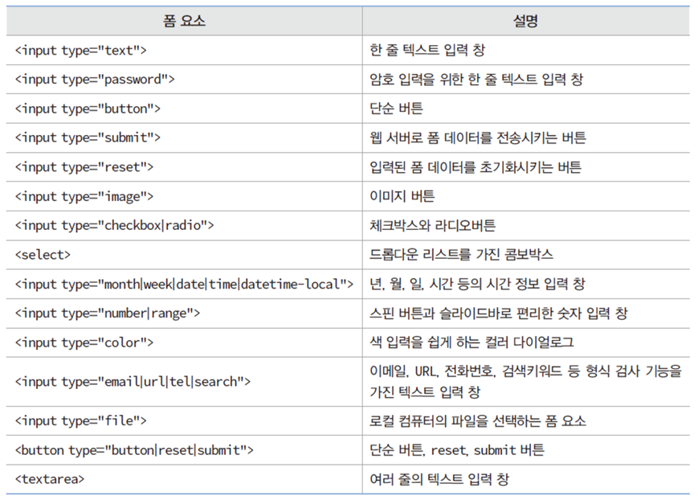

# HTML

## HTML5 문서 구조화

### 기존 HTML의 한계 : 웹 문서 구조를 표현하는 태그 없음

- &lt;div> 태그나 &lt;table> 태그로 구조화되어 보이게 작성

- HTML 페이지의 소스를 보면 문서 구조 파악 불가능
작성

### 시맨틱 웹

- 웹 문서를 구조화하여 의미 있는 내용 탐색이 용이한 웹
- 기존 태그는 문서의 구조나 의미 전달 어려움
```
<p>, <div>, <h1>, <h2>
```

- 시맨틱 태그: 문서의 구조와 의미를 전달하는 태그
```
<header>, <section>, <article>, <main>, <summary>, <mark>, <time>
```

## 시멘틱 태그

- &lt;header>
    - 페이지나 섹션의 머리말 표현
    - 페이지 제목, 페이지를 소개하는 간단한 설명
- &lt;nav>
    - 하이퍼링크들을 모아 놓은 특별한 섹션
    - 페이지 내 목차를 만드는 용도
- &lt;section>
    - 문서의 장(chapter, section) 혹은 절을 구성하는 역할
    - 일반 문서에 여러 장이 있듯이 웹 페이지에 여러 &lt;section>가능
    - 헤딩 태그(&lt;h1>~&lt;h6>)를 사용하여 절 혹은 섹션의 주제 기입
- &lt;article>
    - 본문과 연관 있지만, 독립적인 콘텐트를 담는 영역 혹은 보조 기사, 블로그 포스트, 댓글 등 기타 독립적인 내용
    - &lt;article>에 담는 내용이 많은 경우 여러 &lt;section> 둘 수 있음
- &lt;aside>
    - 본문에서 약간 벗어난 노트나 팁 
    - 신문, 잡지에서 주요 기사 옆 관련 기사, 삽입 어구로 표시된 논평 등
    - 페이지의 오른쪽이나 왼쪽에 주로 배치
- &lt;footer>
    - 꼬리말 영역, 주로 저자나 저작권 정보


## 시멘틱 예제
- body에는 class명만 선언하고 &lt;style> 태그에서 css로 서식 설정
```
<!DOCTYPE html>
<html>
<head><title>HTML5 문서 구조 시맨틱 태그 사용</title>
<style>
html, body { margin: 0; padding: 0; height: 100%; }
.header { width: 100%; height: 15%; 
		background: yellow; }
.nav { width: 15%; height: 70%; float: left; 
		background: orange; }
.section { width: 70%; height: 70%; float: left; 
		background: olivedrab; }
.aside { width: 15%; height: 70%; float: left; 
		background: orange; }
.footer { width: 100%; height: 15%; clear: both; 
		background: plum; }
</style>
</head>
<body>
	<header class="header">header</header>
	<nav class="nav">nav</nav>
	<section class="section">section</section>
	<aside class="aside">aside</aside>
	<footer class="footer">footer</footer>
</body>
</html>
```

## 웹 폼
- 웹 폼
    - 웹페이지에서 사용자 입력을 받는 폼
    - 로그인, 등록, 검색, 예약, 쇼핑 등
- 폼 요소
    - 폼을 만드는 다양한 태그
```
<input>, <textarea>, <select> ...
```

## 로그인 폼
```
<!DOCTYPE html>
<html>
<head><title>로그인 폼</title></head>
<body>
<h3>로그인 폼</h3>
<hr>
<form name="fo" method="get">
사용자 ID : <input type="text" size="15" value=""><br>
비밀 번호 : <input type="password" size="15" value="">
				 <input type="submit" value="완료">
</form>
</body>
</html>
```

## 폼 작성
- &lt;form> 태그로 둘러싸는 모양
```
<form name="fo" method="get">
	...
</form>
```
- name 속성
    - 폼의 이름 지정
<br>
- action 속성
    - 폼 데이터를 처리할 웹 서버 응용프로그램의 이름
    - submit 버튼이 눌리면 브라우저는 action에 지정된 웹 서버 응용프로그램 실행 요청
    - 웹 서버 응용프로그램은 Java, JSP, PHP, C/C++ 등 다양한 언어로 작성
<br>
- method 속성
    - 폼 데이터를 웹 서버로 전송하는 형식
    - 대표적인 전송 방식 : GET, POST 
<br>
<br>
